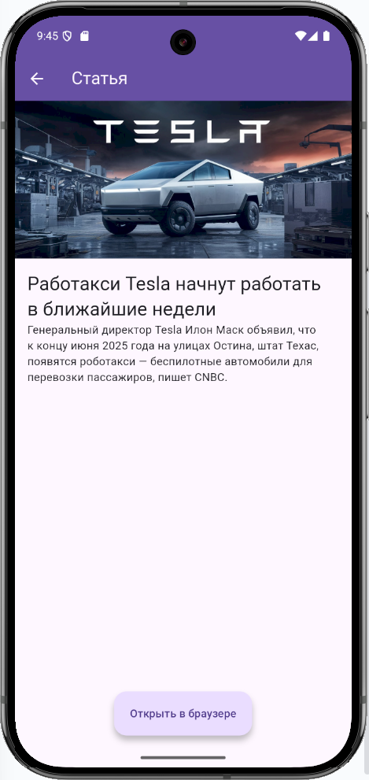
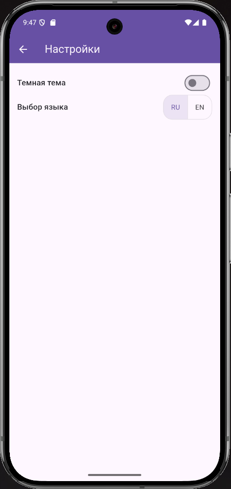

# pr1_news_app

Мобильное приложение для просмотра новостных статей.

## Возможности

- Основной экран с новостями на английском/русском языке (в зависимости от выбранного языка)
- Экран который может отображает подробности по выбранной новстной статье
- Возможность открыть выбранную статью в браузере
- Поддержка светлой и тёмной темы
- Поддержка английского и русского языков
- Пагинация

## Скриншоты

**Главный экран**

**Экран статьи**

**Экран настроек**

**Пример: темная тема и новости на ангийском языке**
